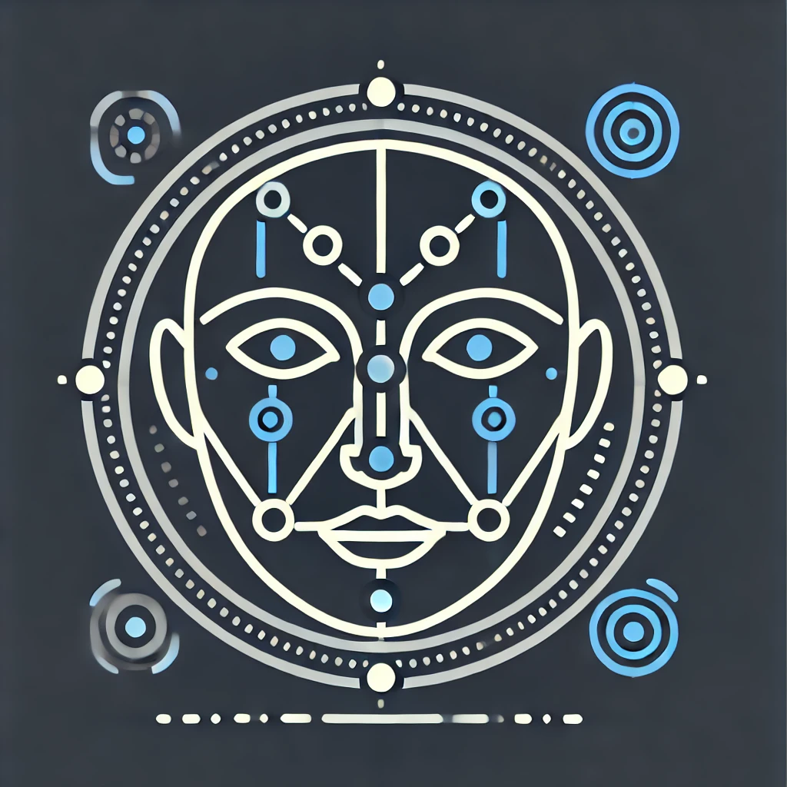

# Face Tracker 3000 Dev Container
## Description
The **Face Tracker 3000** is a personal project created to solidify my skills in various areas and to gain hands-on experience with new concepts. The Face Tracker 3000 is a compact robot featuring a USB camera, a Raspberry Pi 5 as its primary computer, and an Arduino Nano to control movement. Its goal is to identify and track a person’s face, estimate the distance and angle to the target, and then fire a Nerf projectile with precision. 
### Technologies and Concepts
This project brings together various technologies and concepts, including:

- **ROS2**: Powers the robot's autonomy and face-tracking functionality.
- **Docker Dev Container**: Provides an isolated development environment for efficient ROS2 management.
- **Submodules**: Organizes dependencies for streamlined code management and version control.
- **OpenCV and Camera Calibration**: Facilitates face detection, tracking, and camera calibration for accurate distance estimation.
- **Serial Communication (ROS2 & micro-ROS)**: Enables seamless communication between the Raspberry Pi and Arduino Nano for precise control.
- **Arduino Programming**: Controls motor functions and communicates sensor data to the main computer.
- **Inverse Kinematics**: Calculates the required angles for precise aiming and movement.
- **CAD Development**: Custom-designed robot parts for optimal functionality and aesthetic appeal.

### System Architecture
The Face Tracker 3000 consists of several key components that work together to track and respond to a person’s face. Below is an overview of the main components and their interactions:

- **Camera Module**: Captures real-time video footage and sends it to the Raspberry Pi for face detection.
- **Face Detection Node (ROS2)**: Utilizes OpenCV for real-time face tracking, calculating the distance and angle to the target, then publishing these values.
- **Movement Controller (Arduino)**: Receives movement commands from ROS2 via serial communication, adjusting the robot’s orientation to maintain target alignment and computing the shooting speed of the Nerf.

